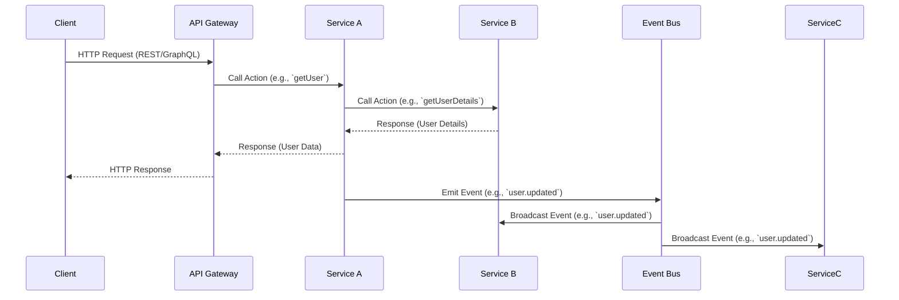

# Moleculer Components and Example Flow

## Components in Moleculer

1. **Services**: Core units of functionality, containing actions and event handlers.
2. **Actions**: Methods exposed by services for direct invocation.
3. **Events**: Mechanism for decoupled communication between services.
4. **Event Bus**: Centralized system for managing events.
5. **API Gateway**: Entry point for external clients, exposing REST/GraphQL endpoints.
6. **Transporter**: Handles communication between nodes in a distributed setup.
7. **Middleware**: Custom logic that can be applied to actions or events.
8. **Broker**: The core of Moleculer, managing services, events, and communication.

---

## Example Flow Diagram

Below is an example flow of a Moleculer-based application:

---

## Explanation of the Flow

1. **Client Interaction**:
   - The client sends an HTTP request to the API Gateway.
   - The Gateway forwards the request to the appropriate service (`Service A`).

2. **Service Communication**:
   - `Service A` calls an action in `Service B` to fetch additional data.
   - `Service B` processes the request and returns the response to `Service A`.

3. **Event Emission**:
   - After processing, `Service A` emits an event (`user.updated`) to the Event Bus.
   - The Event Bus broadcasts the event to all subscribed services (`Service B`, `Service C`).

4. **Response to Client**:
   - The final response is sent back to the client via the API Gateway.

