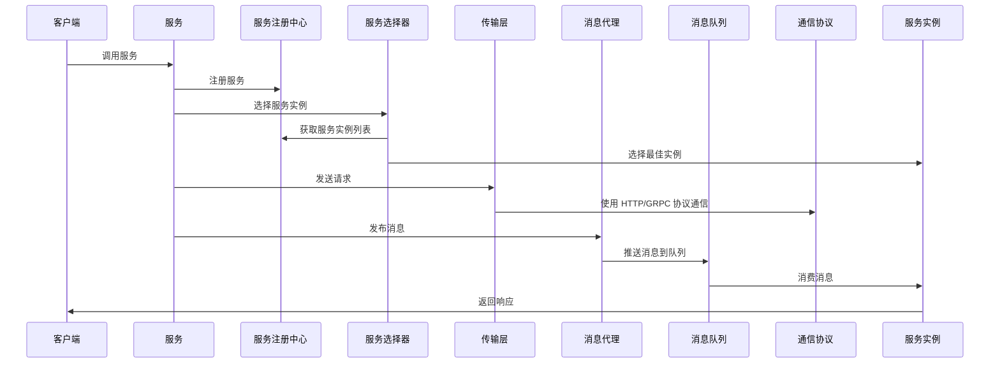

# go-microv5 组件关系图案例（完整调用过程）

以下是一个基于 `go-microv5` 的完整调用过程关系图示例。

## 组件说明

- **客户端 (Client)**: 发起服务调用的入口。
- **服务 (Service)**: 核心业务逻辑处理单元，负责处理请求。
- **服务注册中心 (Registry)**: 管理服务的注册与发现。
- **服务选择器 (Selector)**: 选择合适的服务实例，支持负载均衡。
- **传输层 (Transport)**: 提供网络通信能力，支持多种协议。
- **消息代理 (Broker)**: 实现发布/订阅模式的消息传递。
- **消息队列 (Queue)**: 用于异步消息传递。
- **通信协议 (Protocol)**: 支持 HTTP、gRPC 等协议。
- **服务实例 (ServiceInstance)**: 实际运行的服务节点，处理请求并返回响应。
